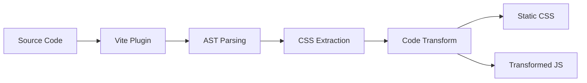

## Architecture Overview

Oink is a **zero-runtime CSS-in-JS library** that extracts CSS at build time. Unlike traditional CSS-in-JS libraries that inject styles at runtime, Oink processes your code during the build phase and outputs static CSS.



## Build Pipeline

The transformation happens in 5 distinct phases:

### 1. File Filtering

**Location:** `packages/vite-plugin-oink/src/index.ts:76-78`

Before parsing, the plugin quickly checks if a file might contain Oink code:

```typescript
function mightContainOink(code: string): boolean {
  return code.includes("oink`") || code.includes("oinkz`");
}
```

This avoids expensive AST parsing for files that don't use Oink.

### 2. AST Parsing

**Location:** `packages/vite-plugin-oink/src/transform.ts:84-156`

Files that might contain Oink are parsed using `oxc-parser`, a fast JavaScript/TypeScript parser:

```typescript
const result = parseSync(filePath, code);
const ast = result.program;
```

The plugin walks the AST to find all tagged template expressions:

```typescript
walk(ast, (node) => {
  if (node.type !== "TaggedTemplateExpression") return;
  
  const tag = node.tag;
  if (!tag || tag.type !== "Identifier") return;
  
  // Only process oink`` and oinkz`` tagged templates
  if (tag.name !== "oink" && tag.name !== "oinkz") return;
  
  const css = extractCssFromTemplateLiteral(node.quasi);
  // ...
});
```

<Warning>
  Template expressions are not supported. The CSS must be a static string:
  
  ```tsx
  // ✗ Not allowed
  const color = 'red'
  oink`color: ${color};`
  
  // ✓ Allowed
  oink`color: red;`
  ```
</Warning>

### 3. CSS Processing

**Location:** `packages/vite-plugin-oink/src/css.ts`

Once CSS is extracted, it's processed differently for `oink()` and `oinkz()`.

<Tabs>
  <Tab title="oink() Processing">
    **Location:** `packages/vite-plugin-oink/src/css.ts:37-49`

    For single-class styles:

    ```typescript
    export function transformCSS(css: string, className: string): string {
      // 1. Preprocess bare pseudo-selectors
      //    :hover { } → &:hover { }
      const preprocessed = preprocessPseudoSelectors(css);
      
      // 2. Wrap in generated class name
      const wrappedCSS = `.${className} { ${preprocessed} }`;
      
      // 3. Expand nesting with postcss-nested
      const result = postcss([nested]).process(wrappedCSS, { from: undefined });
      
      return result.css;
    }
    ```

    **Example transformation:**

    ```css
    /* Input */
    color: black;
    :hover { color: blue; }
    
    /* After preprocessing */
    color: black;
    &:hover { color: blue; }
    
    /* After wrapping */
    .o_abc123 {
      color: black;
      &:hover { color: blue; }
    }
    
    /* After postcss-nested */
    .o_abc123 { color: black; }
    .o_abc123:hover { color: blue; }
    ```
  </Tab>

  <Tab title="oinkz() Processing">
    **Location:** `packages/vite-plugin-oink/src/css.ts:79-132`

    For multi-class stylesheets:

    ```typescript
    export function parseOinkzStyles(
      styles: string,
      generateClassName: (originalName: string) => string,
    ): OinkzResult {
      const classMap = new Map<string, string>();
      const exportedClasses: OinkzClassInfo[] = [];
      
      const root = postcss.parse(styles);
      
      // First pass: collect top-level class names
      root.walkRules((rule) => {
        if (rule.parent?.type !== "root") return;
        
        const match = rule.selector.match(/^\.([a-zA-Z_][a-zA-Z0-9_-]*)$/);
        if (match) {
          const originalName = match[1];
          const generatedName = generateClassName(originalName);
          classMap.set(originalName, generatedName);
          exportedClasses.push({ originalName, generatedName });
        }
      });
      
      // Second pass: replace class references
      root.walkRules((rule) => {
        const hasKnownClass = Array.from(classMap.keys()).some((className) =>
          rule.selector.includes(`.${className}`)
        );
        
        if (hasKnownClass) {
          rule.selector = replaceClassReferences(rule.selector, classMap);
        }
      });
      
      // Process with postcss-nested
      const result = postcss([nested]).process(root, { from: undefined });
      
      return { classes: exportedClasses, css: result.css };
    }
    ```

    **Key behavior:**
    - Only top-level `.className` selectors are exported
    - Global selectors (`:root`, element selectors) are preserved unchanged
    - All class references in selectors are replaced with generated names
  </Tab>
</Tabs>

### 4. Code Transformation

**Location:** `packages/vite-plugin-oink/src/transform.ts:226-513`

The plugin transforms your source code by replacing `oink`` and `oinkz`` calls:

<CodeGroup>

```typescript Basic Replacement
// Development mode (inline: false)
const btn = oink`color: red;`
// Becomes:
const btn = "btn_a1b2c3"

const styles = oinkz`.container { }`
// Becomes:
const styles = { container: "container_abc123" }
```

```typescript Constant Propagation
// Production mode (inline: true or 'production')
const btn = oink`color: red;`
<button className={btn}>

// Becomes:
<button className="o_a1b2c3">
// (variable declaration removed entirely)

const styles = oinkz`.container { } .title { }`
<div className={styles.container}>
<h1 className={styles.title}>

// Becomes:
<div className="o_abc123">
<h1 className="o_def456">
// (variable declaration removed entirely)
```

</CodeGroup>

**Constant propagation algorithm:**

1. **Build parent map:** Track parent nodes for context checking
2. **Find bindings:** Identify all `oink``/`oinkz`` variable declarations
3. **Find references:** Locate all usages of bound variables
4. **Check safety:** Verify all references can be safely inlined
5. **Inline or replace:**
   - If all references are safe: inline values and remove declaration
   - Otherwise: just replace the tagged template with the value

**Safe contexts for inlining:**

```tsx
// ✓ Safe - JSX expression
<div className={btn} />

// ✓ Safe - Template literal
const cls = `${btn} ${other}`

// ✓ Safe - Binary expression
const cls = btn + " " + other

// ✓ Safe - Conditional
const cls = isActive ? btn : other

// ✗ Unsafe - Function argument
doSomething(btn)

// ✗ Unsafe - Array/object
const classes = [btn, other]
const obj = { btn }
```

### 5. CSS Injection

**Location:** `packages/vite-plugin-oink/src/index.ts:187-202`

Generated CSS is injected differently in dev vs. production:

<Tabs>
  <Tab title="Development Mode">
    **Virtual CSS Modules + HMR**

    Each file with Oink styles gets a virtual CSS module:

    ```typescript
    // Original file: src/App.tsx
    const btn = oink`color: red;`
    
    // Transformed:
    import "src/App.tsx.oink.css";  // Virtual module
    const btn = "btn_a1b2c3"
    ```

    The virtual module is handled by Vite:

    ```typescript
    load(id) {
      if (id.startsWith("\0") && id.endsWith(VIRTUAL_CSS_SUFFIX)) {
        const originalFile = id.slice(1, -VIRTUAL_CSS_SUFFIX.length);
        const collected = collectedCSS.get(originalFile);
        
        // Return all CSS for this file
        return cssBlocks.join("\n\n");
      }
    }
    ```

    **HMR Support:**

    When a file changes, the virtual CSS module is invalidated:

    ```typescript
    async handleHotUpdate({ file, server, modules }) {
      const { oinkCalls, oinkzCalls } = findAllOinkCalls(code, file, isDev);
      collectedCSS.set(file, { oinkCalls, oinkzCalls });
      
      const virtualId = "\0" + file + VIRTUAL_CSS_SUFFIX;
      const cssMod = server.moduleGraph.getModuleById(virtualId);
      
      if (cssMod) {
        server.moduleGraph.invalidateModule(cssMod);
        return [...modules, cssMod];  // Trigger HMR for both
      }
    }
    ```
  </Tab>

  <Tab title="Production Mode">
    **@oink Marker Replacement**

    All CSS is collected and injected at a marker in your CSS file:

    ```css
    /* styles.css */
    body {
      font-family: sans-serif;
    }
    
    @oink;
    ```

    During bundle generation:

    ```typescript
    generateBundle(_options, bundle) {
      const allCSS = getAllCollectedCSS();
      
      // Find CSS assets and replace marker
      for (const [_fileName, chunk] of Object.entries(bundle)) {
        if (chunk.type === "asset" && typeof chunk.source === "string") {
          if (chunk.source.includes("@oink")) {
            chunk.source = chunk.source.replace(/@oink;?/g, allCSS);
          }
        }
      }
    }
    ```

    **Result:**

    ```css
    /* styles.css (bundled) */
    body {
      font-family: sans-serif;
    }
    
    /* Generated Oink styles */
    .o_abc123 { color: red; }
    .o_def456 { max-width: 800px; }
    .o_ghi789 { font-size: 2rem; }
    ```
  </Tab>
</Tabs>

## Class Name Generation

**Location:** `packages/vite-plugin-oink/src/utils.ts` (referenced in transform.ts)

Class names are generated deterministically based on:
- File path
- CSS content
- Index within the file (for multiple oink/oinkz calls)
- Original class name (for oinkz)
- Build mode (dev vs. production)

**Development mode:**
```
{originalName}_{hash}
// Examples:
button_a1b2c3
container_def456
```

**Production mode:**
```
o_{hash}
// Examples:
o_a1b2c3
o_def456
```

The hash ensures uniqueness while being deterministic - the same CSS always generates the same class name.

## Type Safety Implementation

Oink provides type safety through two mechanisms:

### Build-Time Validation

**Location:** `packages/vite-plugin-oink/src/transform.ts:549-615`

The Vite plugin validates `oinkz` property accesses:

```typescript
export function validateOinkzAccesses(
  code: string,
  filePath: string,
): OinkzValidationError[] {
  const errors: OinkzValidationError[] = [];
  const bindings: OinkzBinding[] = [];
  
  // First pass: collect all oinkz variables and their class names
  walk(ast, (node) => {
    if (/* is oinkz declaration */) {
      const classNames = extractOinkzClassNames(css);
      bindings.push({ variableName, classNames });
    }
  });
  
  // Second pass: validate property accesses
  walk(ast, (node) => {
    if (node.type === "MemberExpression") {
      const binding = bindings.find(b => b.variableName === obj.name);
      if (binding && !binding.classNames.includes(prop.name)) {
        errors.push({
          property: prop.name,
          variableName: obj.name,
          availableClasses: binding.classNames,
          line, column
        });
      }
    }
  });
  
  return errors;
}
```

**Error example:**

```tsx
const styles = oinkz`.container { } .title { }`
<div className={styles.notExist} />

// Build error:
// App.tsx:12:34 - Property 'notExist' does not exist on 'styles'.
// Available: container, title
```

### TypeScript Language Service Plugin

**Package:** `typescript-plugin-oink`

The TypeScript plugin provides IDE support:
- Autocomplete for `oinkz` class names
- Type errors for non-existent properties
- Hover information

It works by:
1. Parsing the source file to find `oinkz` calls
2. Extracting class names from the CSS
3. Creating a virtual type: `Record<"container" | "title", string>`
4. Injecting this type into the language service

## Performance Optimizations

### Quick Bailouts

String search before AST parsing:
```typescript
if (!code.includes("oink`") && !code.includes("oinkz`")) {
  return null;  // Skip parsing entirely
}
```

### AST Walking

Single-pass AST traversal collects all information:
- Find declarations
- Build parent map
- Find references
- All in one walk

### Magic String

Uses `magic-string` for efficient code transformations:
```typescript
const s = new MagicString(code);
s.overwrite(node.start, node.end, replacement);
return s.toString();
```

Only modified ranges are rewritten, not the entire file.

### CSS Parsing

PostCSS is only invoked for actual CSS processing, not for validation or class name extraction.

## Comparison with Other Approaches

| Feature | Oink | styled-components | CSS Modules | Tailwind |
|---------|------|-------------------|-------------|-----------|
| **Runtime** | Zero | Yes (~14kb) | Zero | Zero |
| **Co-location** | Yes | Yes | No | Yes |
| **Type safety** | Build + TS plugin | No | TypeScript (.d.ts) | No |
| **Nesting** | Full CSS nesting | Yes | Depends on preprocessor | No |
| **Bundle size** | No JS overhead | Large | No JS overhead | Large CSS |
| **Dynamic styles** | No | Yes | No | With JIT |
| **Build time** | Fast (AST-based) | N/A | Fast | Fast |

## Advanced: Plugin Configuration

```typescript
import { oinkPlugin } from 'vite-plugin-oink'

export default defineConfig({
  plugins: [
    oinkPlugin({
      // Control constant propagation
      inline: 'production'  // true | false | 'production'
    })
  ]
})
```

**Inline modes:**

- `true` - Always inline (smallest output, less debuggable)
- `false` - Never inline (larger output, more debuggable)
- `'production'` (default) - Inline in prod, preserve in dev

## See Also

- [oink() API Reference](/concepts/oink-api) - Single-class style API
- [oinkz() API Reference](/concepts/oinkz-api) - Multi-class stylesheet API
